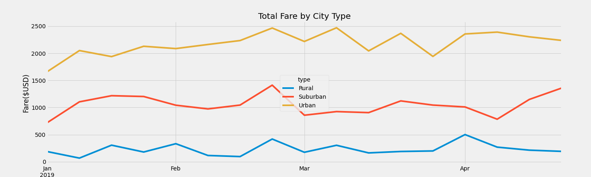

# PyBer_Analysis

## Overview & Purpose
The purpose of the new analysis is well defined -- we want to to compare the rides between city types in order to determine
## Results

Using images from the summary DataFrame and multiple-line chart, describe the differences in ride-sharing data among the different city types.

There is a description of the differences in ride-sharing data among the different city types. Ride-sharing data include the total rides, total drivers, total fares, average fare per ride and driver, and total fare by city type
## Summary
There is a statement summarizing three business recommendations to the CEO for addressing any disparities among the city types.
