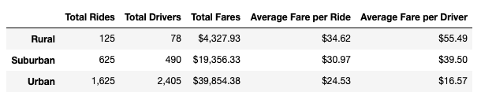

# PyBer_Analysis

## Overview & Purpose
The purpose of this analysis is to help improve access to ride-sharing services and determine affordability for underserved neighborhoods. To do this, we compared the ride-sharing data for three city types (urban, suburban, and rural) between January and May 2019. We compiled the findings in easily digestible visualizations for the decision makers at PyBer. 

## Results

#### Ride-sharing data summary by city type

There were far more rides completed in urban cities than there were in suburban or rural cities. The **total number of rides** in urban cities was thirteen times the number of rides completed in rural cities, and over 2.5 times more than the rides in suburban cities. Similarly, there are thirty times as many **total drivers** in urban cities as there are in rural cities, and almost five times as many drivers in urban cities as there are in urban cities. In terms of revenue, the **total fare** from urban city rides reached almost $40k, which is nearly ten times the revenue from rural city rides (coming in at just over $4k). Despite the major difference in total fares, urban rides actually have a lower **average fare per ride** than suburban or rural rides. Not only is the average fare much lower, but the **average fare per driver** in urban cities is $16.57, where suburban drivers average almost $40 per ride, and rural drivers average $55.49 per ride.

#### Total fares by city type

Urban cities have many more rides, but a lower fare per ride and per driver. Suburban and rural cities, on the other hand, don't see as many rides. The rides they do have average much higher fares per ride and driver.

## Summary
Based on this analysis, we can make three recommendations for addressing the disparity between cities.

1) PyBer could employ more drivers in rural and suburban cities to provide more access for riders. 
2) PyBer could add a surcharge to very short rides in urban cities to increase the average fare per ride.
3) PyBer could increase their advertising and marketing in rural and suburban cities to increase the number of rides in those cities.
